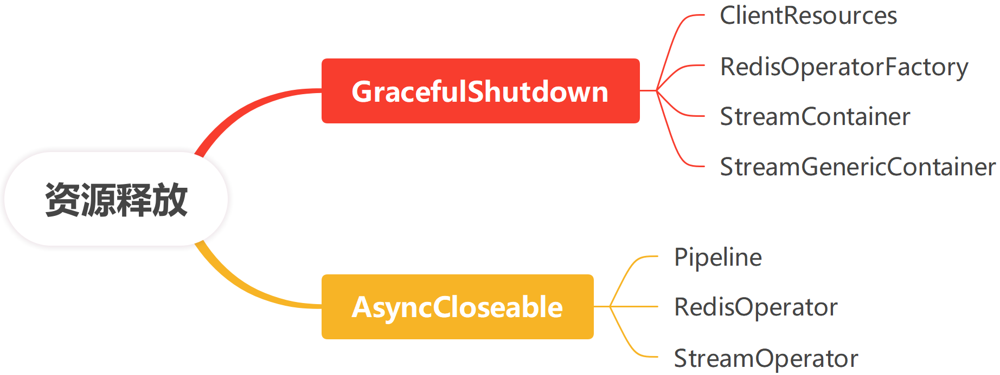

## Xredis  Reference Guide

**Author**: Patrick.Lau		**Version**: 1.0.0

[](https://www.apache.org/licenses/LICENSE-2.0.html) [](https://github.com/patricklaux/xredis/releases) [](https://central.sonatype.com/namespace/com.igeeksky.xredis) [](https://github.com/patricklaux/xredis/commits)


## 1. 基本说明

### 1.1. 文档版本

此文档最新版本位于 https://github.com/patricklaux/xredis/blob/main/docs/Reference.md，如您有任何改进，非常欢迎您提交 pr。

### 1.2. 获取帮助

https://github.com/patricklaux/xredis/discussions

如您希望了解如何使用 xredis，或在使用中遇到问题无法解决，欢迎在此提问。

### 1.3. 建议反馈

https://github.com/patricklaux/xredis/issues

如您发现功能缺陷，或有任何开发建议，欢迎在此提交。

如您发现安全漏洞，请私信与我联系。

### 1.4. 项目测试

https://github.com/patricklaux/xredis/tree/main/xredis-test

如您希望扩展实现，又或者对某处代码逻辑有疑问，您可以参考此测试项目，并对相关实现进行调试。

当然，也欢迎您补充更多的测试用例。

## 2. 相关介绍

### 2.1. 简介

Xredis 是对 Lettuce 的一个薄封装，最大限度地保留了 Lettuce 的原生 API。

1. 统一 standalone、sentinel 和 cluster 的 API，统一通过 RedisOperator 操作数据。
2. 提供 RedisSyncOperator 、RedisAsyncOperator 和 RedisReactiveOperator  接口，可以根据业务场景灵活使用不同的编程范式。
3. 提供 Pipeline 接口，支持批提交命令。
4. 提供 StreamContainer，简化 stream 订阅。
5. 提供 RedisOperatorProxy，简化批数据操作，提高批数据操作性能。
6. 提供 SpringBoot 自动配置，可以通过配置文件直接配置 Lettuce 的绝大部分配置项（除了需编程实现的特殊配置）。

总之，项目的初衷就是希望提供更灵活的原生 API，得到更好的性能表现，简化一些常用的数据操作。

### 2.3. 运行环境

**SpringBoot**： 3.4.0+

**Lettuce**： 6.5.4.RELEASE+

**JDK**： 21+

作为新项目，自然要支持 JDK 最让人兴奋的更新：虚拟线程，所以 **JDK** 的要求是 21+。

另外，Redis Server 也有一些比较令人心动的新功能，譬如 ``JSON`` 支持，譬如 ``Hash`` 字段过期时间设置，而这些新特性只有 **Lettuce** 的最新版本才支持，所以 **Lettuce** 版本要求是 6.5.4.RELEASE+。

## 3. 基本使用

以下代码片段来自于 [xredis-samples](https://github.com/patricklaux/xredis-samples)，如需获取更详细信息，您可以克隆示例项目到本地进行调试。

```bash
git clone https://github.com/patricklaux/xredis-samples.git
```

### 3.0. Maven bom

Xredis 支持 bom 方式统一管理版本，可在 pom.xml 文件中添加如下配置片段，后续引入组件依赖时可省略版本号。

```xml
<dependencyManagement>
    <dependencies>
        <dependency>
            <groupId>com.igeeksky.xredis</groupId>
            <artifactId>xredis</artifactId>
            <version>${xredis.version}</version>
            <type>pom</type>
            <scope>import</scope>
        </dependency>
    </dependencies>
</dependencyManagement>
```

### 3.1. 第一步：引入依赖

```xml
<dependencies>
    <!-- ... xredis 依赖 ... -->
    <dependency>
        <groupId>com.igeeksky.xredis</groupId>
        <artifactId>xredis-lettuce-spring-boot-autoconfigure</artifactId>
        <version>${xredis.version}</version>
    </dependency>

    <!-- ... 其它：假定使用 SpringWeb ... -->
    <dependency>
        <groupId>org.springframework.boot</groupId>
        <artifactId>spring-boot-starter-web</artifactId>
        <version>${spring.boot.version}</version>
    </dependency>
</dependencies>
```

### 3.2. 第二步：编写配置

```yaml
xredis:
  lettuce: # Lettuce 客户端配置
    standalone: # 单机模式 或 副本集模式
      node: 127.0.0.1:6379 # Redis 节点
```

以上，就是 xredis 的最简配置，其余配置项都采用默认配置。

当然，如果你希望更精细地控制 Lettuce 客户端，或者想看看完整的配置项，那么，请查看示例项目的 ``application-all.yml`` 文件。

### 3.3. 第三步：调用方法

这里将 Redis Server 作为用户信息数据库来使用，且仅演示了 ``async`` 异步操作。

```java
@Service
public class UserService {

    private final RedisOperator<String, String> redisOperator;
    private final JacksonCodec<User> codec = new JacksonCodec<>(User.class);

    /**
     * 使用 Spring 注入的 RedisOperator，创建 UserService
     *
     * @param redisOperator RedisOperator
     */
    public UserService(RedisOperator<String, String> redisOperator) {
        this.redisOperator = redisOperator;
    }

    /**
     * 添加用户信息
     *
     * @param user 用户信息
     * @return 添加结果
     */
    public CompletableFuture<Response<Void>> addUser(User user) {
        return redisOperator.async().set(user.getId() + "", codec.encode(user))
                .toCompletableFuture()
                .thenApply(result -> {
                    if (Objects.equals("OK", result)) {
                        return Response.ok();
                    }
                    return Response.error("Failed to add user.");
                });
    }

    /**
     * 获取用户信息
     *
     * @param id 用户 ID
     * @return 用户信息
     */
    public CompletableFuture<Response<User>> getUser(Long id) {
        return redisOperator.async().get(id + "")
                .toCompletableFuture()
                .thenApply(s -> {
                    if (s == null) {
                        return Response.error("User not found.");
                    }
                    return Response.ok(codec.decode(s));
                });
    }

    /**
     * 删除用户信息
     *
     * @param id 用户 ID
     * @return 删除结果
     */
    public CompletableFuture<Response<Void>> deleteUser(Long id) {
        return redisOperator.async().del(id + "")
                .toCompletableFuture()
                .thenApply(result -> {
                    if (Objects.equals(1L, result)) {
                        return Response.ok();
                    }
                    return Response.error("User doesn't exist.");
                });
    }

}
```

## 4. 进阶使用

### 4.1. 同步接口（sync）


### 4.2. 异步接口（async）


### 4.3. 响应式接口（reactive）


### 4.4. 管道接口（pipeline）


## 5. 功能增强

### 5.1. 流操作


### 5.2. 批操作


## 6. 资源释放




## 7. 项目模块

Xredis 当前共有 5 个模块，以下是各模块的简单介绍。

| 模块名称                                 | 类型 | 模块说明                                                   |
| :--------------------------------------- | :--: | :--------------------------------------------------------- |
| xredis                                   | pom  | 所有子项目的最顶层父项目，用于统一项目构建和版本依赖。     |
| xredis-common                            | jar  | 基础模块，用于定义基础接口，及与客户端实现无关的扩展功能。 |
| xredis-lettuce                           | jar  | 核心模块，主要用于实现具体的客户端逻辑。                   |
| xredis-lettuce-resources-autoconfigure   | jar  | 依赖于 SpringBoot，自动配置并创建客户端需用到的相关资源。  |
| xredis-lettuce-spring-boot-autoconfigure | jar  | 依赖于 SpringBoot，自动配置并创建 Redis 客户端。           |

