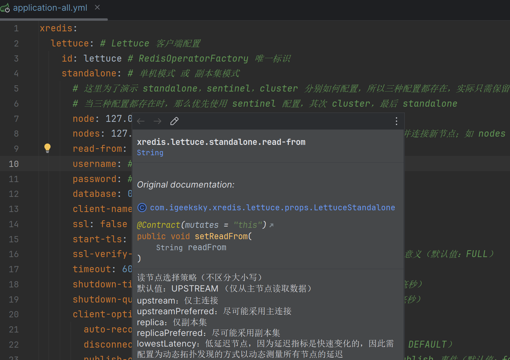

## Xredis  Reference Guide

**Author**: Patrick.Lau		**Version**: 1.0.0

[](https://www.apache.org/licenses/LICENSE-2.0.html) [](https://github.com/patricklaux/xredis/releases) [](https://central.sonatype.com/namespace/com.igeeksky.xredis) [](https://github.com/patricklaux/xredis/commits)


## 1. 基本说明

### 1.1. 文档版本

此文档最新版本位于 https://github.com/patricklaux/xredis/blob/main/docs/Reference.md，如您有任何改进，非常欢迎您提交 pr。

### 1.2. 获取帮助

https://github.com/patricklaux/xredis/discussions

如您希望了解如何使用 xredis，或在使用中遇到问题无法解决，欢迎在此提问。

### 1.3. 建议反馈

https://github.com/patricklaux/xredis/issues

如您发现功能缺陷，或有任何开发建议，欢迎在此提交。

如您发现安全漏洞，请私信与我联系。

### 1.4. 项目测试

https://github.com/patricklaux/xredis/tree/main/xredis-test

如您希望扩展实现，又或者对某处代码逻辑有疑问，您可以参考此测试项目，并对相关实现进行调试。

当然，也欢迎您补充更多的测试用例。

## 2. 相关介绍

### 2.1. 简介

Xredis 是对 Lettuce 的一个薄封装，最大限度地保留了 Lettuce 的原生 API。

1. 统一 standalone、sentinel 和 cluster 的 API，统一通过 RedisOperator 操作数据。
2. 提供 RedisSyncOperator 、RedisAsyncOperator 和 RedisReactiveOperator  接口，可以根据业务场景灵活使用不同的编程范式。
3. 提供 Pipeline 接口，支持批提交命令。
4. 提供 StreamContainer，简化 stream 订阅。
5. 提供 RedisOperatorProxy，简化批数据操作，提高批数据操作性能。
6. 提供 SpringBoot 自动配置，可以通过配置文件直接配置 Lettuce 的绝大部分配置项（除了需编程实现的特殊配置）。

总之，项目的初衷就是希望提供更灵活的原生 API，得到更好的性能表现，简化一些常用的数据操作。

### 2.3. 运行环境

**SpringBoot**： 3.4.0+

**Lettuce**： 6.5.4.RELEASE+

**JDK**： 21+

作为新项目，自然要支持 JDK 最让人兴奋的更新：虚拟线程，所以 **JDK** 的要求是 21+。

另外，Redis Server 也有一些比较令人心动的新功能，譬如 ``JSON`` 支持，譬如 ``Hash`` 字段过期时间设置，而这些新特性只有 **Lettuce** 的最新版本才支持，所以 **Lettuce** 版本要求是 6.5.4.RELEASE+。

## 3. 项目示例

以下代码片段来自于示例项目 [xredis-samples](https://github.com/patricklaux/xredis-samples)，如需获取更详细信息，您可以克隆示例项目到本地进行调试。

```bash
git clone https://github.com/patricklaux/xredis-samples.git
```

### 3.0. Maven bom

Xredis 支持 bom 方式，可在 pom.xml 文件中添加如下配置统一管理版本依赖。

```xml
<dependencyManagement>
    <dependencies>
        <dependency>
            <groupId>com.igeeksky.xredis</groupId>
            <artifactId>xredis</artifactId>
            <version>${xredis.version}</version>
            <type>pom</type>
            <scope>import</scope>
        </dependency>
    </dependencies>
</dependencyManagement>
```

### 3.1. 第一步：引入依赖

```xml
<dependencies>
    <!-- ... xredis 依赖 ... -->
    <dependency>
        <groupId>com.igeeksky.xredis</groupId>
        <artifactId>xredis-lettuce-spring-boot-autoconfigure</artifactId>
        <version>${xredis.version}</version>
    </dependency>

    <!-- ... 其它：假定使用 SpringWeb ... -->
    <dependency>
        <groupId>org.springframework.boot</groupId>
        <artifactId>spring-boot-starter-web</artifactId>
        <version>${spring.boot.version}</version>
    </dependency>
</dependencies>
```

### 3.2. 第二步：编写配置

```yaml
xredis:
  lettuce: # Lettuce 客户端配置
    standalone: # 单机模式 或 副本集模式
      node: 127.0.0.1:6379 # Redis 节点
```

以上，就是 xredis 的最简配置，其余配置项不填的话都将采用默认配置。

当然，如果你希望更精细地控制客户端行为，或者想看看完整的配置项，那么，请查看[7. 完全配置](#7. 完全配置)。

### 3.3. 第三步：调用方法

这里是将 Redis Server 作为用户信息数据库来使用，并使用 ``async`` 异步操作 Redis 数据。

```java
@Service
public class UserService {

    private final RedisOperator<String, String> redisOperator;
    private final JacksonCodec<User> codec = new JacksonCodec<>(User.class);

    /**
     * 使用 Spring 注入的 RedisOperator，创建 UserService
     *
     * @param redisOperator RedisOperator
     */
    public UserService(RedisOperator<String, String> redisOperator) {
        this.redisOperator = redisOperator;
    }

    /**
     * 添加用户信息
     *
     * @param user 用户信息
     * @return 添加结果
     */
    public CompletableFuture<Response<Void>> addUser(User user) {
        return redisOperator.async().set(user.getId() + "", codec.encode(user))
                .toCompletableFuture()
                .thenApply(result -> {
                    if (Objects.equals("OK", result)) {
                        return Response.ok();
                    }
                    return Response.error("Failed to add user.");
                });
    }

    /**
     * 获取用户信息
     *
     * @param id 用户 ID
     * @return 用户信息
     */
    public CompletableFuture<Response<User>> getUser(Long id) {
        return redisOperator.async().get(id + "")
                .toCompletableFuture()
                .thenApply(s -> {
                    if (s == null) {
                        return Response.error("User not found.");
                    }
                    return Response.ok(codec.decode(s));
                });
    }

    /**
     * 删除用户信息
     *
     * @param id 用户 ID
     * @return 删除结果
     */
    public CompletableFuture<Response<Void>> deleteUser(Long id) {
        return redisOperator.async().del(id + "")
                .toCompletableFuture()
                .thenApply(result -> {
                    if (Objects.equals(1L, result)) {
                        return Response.ok();
                    }
                    return Response.error("User doesn't exist.");
                });
    }

}
```

## 4. 基本使用

原生 Lettuce API，集群连接是 ``StatefulRedisClusterConnection``，非集群连接是 ``StatefulRedisConnection``，上层应用需明确知道使用的连接类型，或需通过一些特别转换才能屏蔽类型信息，很多场景会非常不便。

``RedisOperator`` 则不再区分集群与非集群，提供了一套统一的接口，当应用在集群与非集群之间切换时无需修改代码。

```java
/**
 * Redis 操作入口
 */
public interface RedisOperator<K, V> extends ConnectionMode, AsyncCloseable {

    /**
     * 获取同步操作客户端
     *
     * @return RedisSyncOperator
     */
    RedisSyncOperator<K, V> sync();

    /**
     * 获取异步操作客户端
     *
     * @return RedisAsyncOperator
     */
    RedisAsyncOperator<K, V> async();

    /**
     * 获取响应式操作客户端
     *
     * @return RedisReactiveOperator
     */
    RedisReactiveOperator<K, V> reactive();

}
```

``RedisOperator`` 有两个具体实现：一是非集群模式 ``LettuceOperator``；二是集群模式 ``LettuceClusterOperator``。

当应用需要执行事务命令时，那么需要明确声明为 ``LettuceOperator``；当应用需要执行一些特殊的集群命令时，那么需要明确声明为 ``LettuceClusterOperator``。

除这两种情况之外，都建议直接声明为 ``RedisOperator`` 。

### 4.1. 同步操作（sync）

```java
@SpringBootTest
public class RedisOperatorTest {

    @Autowired
    private RedisOperator<String, String> redisOperator;

    @Test
    void hget() {
        String key = "test-key", field = "test-field", value = "test-value";
        redisOperator.sync().del(key);

        Boolean status = redisOperator.sync().hset(key, field, value);
        Assertions.assertEquals(Boolean.TRUE, status);

        String result = redisOperator.sync().hget(key, field);
        Assertions.assertEquals(value, result);
    }

}
```

### 4.2. 异步操作（async）

```java
@SpringBootTest
public class RedisOperatorTest {

    @Autowired
    private RedisOperator<String, String> redisOperator;

    @Test
    void hgetAsync() throws ExecutionException, InterruptedException {
        String key = "test-key", field = "test-field", value = "test-value";
        redisOperator.sync().del(key);

        RedisFuture<Boolean> future = redisOperator.async().hset(key, field, value);
        Assertions.assertEquals(Boolean.TRUE, future.get());

        RedisFuture<String> result = redisOperator.async().hget(key, field);
        Assertions.assertEquals(value, result.get());
    }

}
```

### 4.3. 响应式操作（reactive）

```java
@SpringBootTest
public class RedisOperatorTest {

    @Autowired
    private RedisOperator<String, String> redisOperator;

    @Test
    void hgetReactive() {
        String key = "test-key", field = "test-field", value = "test-value";
        redisOperator.sync().del(key);

        Mono<Boolean> mono = redisOperator.reactive().hset(key, field, value);
        Assertions.assertEquals(Boolean.TRUE, mono.block());

        Mono<String> result = redisOperator.reactive().hget(key, field);
        Assertions.assertEquals(value, result.block());
    }

}
```

### 4.4. 管道操作（pipeline）

某些情况下，为了提高大批量操作数据的性能，我们会希望能够批量提交命令，而不是每个命令都提交一次。

此时，我们可以通过 ``Pipeline`` 来处理。

#### 4.4.1. 创建 Pipeline

考虑到 ``Pipeline`` 操作并不常用，因此并没有通过自动配置类创建该对象，如需使用，需通过如下代码进行创建。

> 注意：``RedisOperatorFactory`` 已通过 ``LettuceAutoConfiguration`` 预创建，这里直接使用注入的对象即可。

```java
/**
 * Pipeline 自动配置类
 */
@Configuration
public class PipelineAutoConfiguration {

    /**
     * 通过预创建的 RedisOperatorFactory 创建 Pipeline
     *
     * @param factory RedisOperatorFactory
     * @return Pipeline
     */
    @Bean
    Pipeline<String, String> pipeline(RedisOperatorFactory factory) {
        return factory.pipeline(StringCodec.UTF8);
    }

}
```

#### 4.4.2. 测试 Pipeline

```java
@SpringBootTest
public class PipelineTest {

    @Autowired
    private Pipeline<String, String> pipeline;

    @Test
    public void test() throws ExecutionException, InterruptedException {
        // 1. 删除已有数据
        pipeline.del("key1", "key2", "key3");
        // 2. 设置数据
        pipeline.set("key1", "value1");
        pipeline.set("key2", "value2");
        pipeline.set("key3", "value3");
        // 3. 批量提交命令
        pipeline.flushCommands();

        // 4. 获取数据
        RedisFuture<String> result1 = pipeline.get("key1");
        RedisFuture<String> result2 = pipeline.get("key2");
        RedisFuture<String> result3 = pipeline.get("key3");
        // 5. 批量提交命令
        pipeline.flushCommands();

        Assertions.assertEquals("value1", result1.get());
        Assertions.assertEquals("value2", result2.get());
        Assertions.assertEquals("value3", result3.get());
    }

}
```

#### 4.4.3. Pipeline 说明

##### 异步

``Pipeline`` 仅支持 ``async`` 方式调用，除了需手动调用 ``pipeline.flushCommands()`` 提交命令之外，其调用方式与 ``RedisAsyncOperator`` 完全一致。

``Pipeline`` 其实就是预调用了 ``StatefulConnection.setAutoFlushCommands(false)`` 而已。

##### 性能

经过我的简单测试，``Pipeline`` 批量提交命令 和 ``RedisAsyncOperator`` 逐个提交命令，两者有一定的性能差异，但差距微小。

因为 ``RedisAsyncOperator`` 是异步操作，调用者无需等待上一命令的返回结果就可以接着发出下一个命令，其实与批量提交命令差别不大，批量提交命令仅仅是减少了 ``flush`` 次数带来了一些微弱的优势。

总之，大多数情况下，使用 ``RedisAsyncOperator`` 即可。

##### 实现类

非集群模式：``LettucePipeline``

集群模式：``LettuceClusterPipeline``

##### 线程安全

``Pipeline`` 从设计目标上来说是线程安全的。

也就是说，多个线程可以共享使用一个 ``Pipeline`` 对象，但每个线程批量提交命令后都需要调用  ``pipeline.flushCommands()`` ，才能将命令发送到 Redis Server。

譬如，线程1 提交命令后，还未调用 ``flushCommands()``，而线程2 调用了  ``flushCommands()``，那么线程1 的命令也会被提交，并且线程1和线程2 都会收到各自的命令的正确响应结果。

另外，如果线程1 的命令已经被线程2 提交，线程1 随后再调用   ``flushCommands()`` ，两个线程各自收到的命令响应结果依然是正确的。

##### 关于 bug 

Lettuce 的批量提交命令实现其实有小 bug，有时会遗漏命令，导致 ``RedisFuture`` 一直等待而无法得到结果，最后报命令超时异常。

GitHub 上的官方说明是可能需等到 ``6.6.0`` 版本才会修复。

### 4.5. 小结

通过以上示例，其实可以发现 xredis 接口与 Lettuce 原生接口调用方式是完全一致的，事实上 ``RedisSyncOperator``、``RedisAsyncOperator``、``RedisReactiveOperator`` 和 ``Pipeline`` 接口都是继承自 Lettuce 原生接口。

Q：是否会有性能损失？

A：不会，只是将接口重新组织，既没有再加一层，也没有对象类型转换。

Q：是否会有功能损失？

A：不会，实现类也是继承自 Lettuce 的原生类。

总之，原生 API 怎么用就怎么用，原生 API 什么性能就什么性能，原生 API 有什么 bug 就有什么 bug。

## 5. 扩展实现

### 5.1. 流操作


### 5.2. 批操作


## 6. 资源释放

Xredis 关于资源释放有两类接口：

一是 ``GracefulShutdown``，支持优雅停机，主要是一些池化类对象和工厂类对象实现此接口，可以通过配置调整静默时长和等待超时。

二是 ``AsyncCloseable``，主要是连接类对象。


## 7. 完全配置

### 7.1. 所有配置项

即示例项目的 ``application-all.yml``。

```yaml
xredis:
  lettuce: # Lettuce 客户端配置
    id: lettuce # RedisOperatorFactory 唯一标识
    standalone: # 单机模式 或 副本集模式
      # 这里为了演示 standalone，sentinel，cluster 分别如何配置，所以三种配置都存在，实际只需保留真正使用的其中一种
      # 当三种配置都存在时，那么优先使用 sentinel 配置，其次 cluster，最后 standalone
      node: 127.0.0.1:6379 # Redis 节点（支持 UnixSocket 方式）
      nodes: 127.0.0.1:6378 # Redis 节点列表（如 nodes 无配置，主动发现并连接新节点；如 nodes 有配置，仅连接已配置的节点）
      read-from: # 读节点选择策略（默认值：UPSTREAM，仅从主节点读取数据）
      username: # Redis 用户名
      password: # Redis 密码
      database: 0 # Redis 数据库索引（默认值：0）
      client-name: # Redis 客户端名称
      ssl: false # 是否启用 SSL（默认值：false）
      start-tls: false # 是否启用 TLS（默认值：false）
      ssl-verify-mode: FULL # SSL 验证模式，只有 ssl 配置为 true 时才有意义（默认值：FULL）
      timeout: 60000 # 命令响应的最大等待时长（默认值：60000 单位：毫秒）
      shutdown-timeout: 2000 # 优雅停机最大等待时长（默认值：1000 单位：毫秒）
      shutdown-quiet-period: 100 # 优雅停机静默时长（默认值：100 单位：毫秒）
      client-options: # 客户端选项，一般保持默认即可
        auto-reconnect: true # 是否自动重连（默认值：true）
        disconnected-behavior: DEFAULT # 连接断开后是否接受命令（默认值：DEFAULT）
        publish-on-scheduler: false # 是否使用专用的 scheduler 处理 publish 事件（默认值：false）
        ping-before-activate-connection: true # 连接激活前是否发送 PING 消息（默认值：true）
        protocol-version: RESP2 # Redis 协议版本（默认值：RESP3，Redis 6.0 以下请配置为 RESP2）
        suspend-reconnect-on-protocol-failure: # 是否在协议失败时暂停重连（默认值：false）
        request-queue-size: # 请求队列大小 （默认值：Integer.MAX_VALUE）
        socket-options: # socket 配置选项
          connect-timeout: 10000 # Socket 连接超时（默认值：10000， 单位：毫秒）
          tcp-no-delay: true  # 是否启用 TCP_NODELAY（默认值：true）
          keep-alive: # KeepAlive 配置选项，仅适用于 epoll、 io_uring、Java 11 及之后版本的 NIO
            enabled: false # 是否启用 KeepAlive（默认值：false）
            count: 9 # KeepAlive 重试次数（默认值：9）
            idle: 7200000 # KeepAlive 空闲时间（默认值：7200000， 单位：毫秒）
            interval: 75000 # KeepAlive 发送间隔（默认值：75000， 单位：毫秒）
          tcp-user-timeout: # TCP_USER_TIMEOUT 配置选项，仅适用于 epoll 和 io_uring
            enabled: false # 是否启用 TCP_USER_TIMEOUT（默认值：false）
            tcp-user-timeout: 7875000 # TCP 超时配置（默认值：7875000 单位：毫秒）
        ssl-options: # SSL 配置选项，只有 ssl 配置为 true 时才有意义
          ssl-provider: JDK # （默认值：JDK）
          key-store-type: # 密钥库格式（默认值：jks）
          keystore: # 密钥库路径
          keystore-password: # 密钥库密码
          truststore: # 信任库路径
          truststore-password: # 信任库密码
          protocols: # 支持的安全协议
          cipher-suites: # 支持的加密套件
          handshake-timeout: # 握手超时（默认值：10000 单位：毫秒）
        timeout-options: # 命令超时配置选项
          fixedTimeout: # 固定超时时间（默认值：-1，单位：毫秒，无超时配置）
    sentinel: # 哨兵模式配置
      # 这里为了演示 standalone，sentinel，cluster 分别如何配置，所以三种配置都存在，实际只需保留真正使用的其中一种
      # 当三种配置都存在时，那么优先使用 sentinel 配置，其次 cluster，最后 standalone
      master-id: mymaster # 哨兵主节点名称
      nodes: 127.0.0.1:26377, 127.0.0.1:26378, 127.0.0.1:26379 # 哨兵节点列表
      read-from: # 读节点选择策略（默认值：UPSTREAM，仅从主节点读取数据）
      sentinel-username:  # 哨兵用户名
      sentinel-password:  # 哨兵密码
      username:  # Redis 用户名
      password:  # Redis 密码
      database: 0 # Redis 数据库索引（默认值：0）
      client-name: # Redis 客户端名称
      ssl: false # 是否启用 SSL（默认值：false）
      start-tls: false # 是否启用 TLS（默认值：false）
      ssl-verify-mode: FULL # SSL 验证模式，只有 ssl 配置为 true 时才有意义（默认值：FULL）
      timeout:  # 命令响应的最大等待时长（默认值：60000 单位：毫秒）
      shutdown-timeout: 2000 # 优雅停机最大等待时长（默认值：1000 单位：毫秒）
      shutdown-quiet-period: 100 # 优雅停机静默时长（默认值：100 单位：毫秒）
      client-options: # 客户端选项，一般保持默认即可
        auto-reconnect: true # 是否自动重连（默认值：true）
        disconnected-behavior: DEFAULT # 连接断开后是否接受命令（默认值：DEFAULT）
        publish-on-scheduler: false # 是否使用专用的 scheduler 处理 publish 事件（默认值：false）
        ping-before-activate-connection: true # 连接激活前是否发送 PING 消息（默认值：true）
        protocol-version: RESP2 # Redis 协议版本（默认值：RESP3，Redis 6.0 以下请配置为 RESP2）
        suspend-reconnect-on-protocol-failure: # 是否在协议失败时暂停重连（默认值：false）
        request-queue-size: # 请求队列大小 （默认值：Integer.MAX_VALUE）
        socket-options: # socket 配置选项
          connect-timeout: 10000 # Socket 连接超时（默认值：10000， 单位：毫秒）
          tcp-no-delay: true  # 是否启用 TCP_NODELAY（默认值：true）
          keep-alive: # KeepAlive 配置选项，仅适用于 epoll、 io_uring、Java 11 及之后版本的 NIO
            enabled: false # 是否启用 KeepAlive（默认值：false）
            count: 9 # KeepAlive 重试次数（默认值：9）
            idle: 7200000 # KeepAlive 空闲时间（默认值：7200000， 单位：毫秒）
            interval: 75000 # KeepAlive 发送间隔（默认值：75000， 单位：毫秒）
          tcp-user-timeout: # TCP_USER_TIMEOUT 配置选项，仅适用于 epoll 和 io_uring
            enabled: false # 是否启用 TCP_USER_TIMEOUT（默认值：false）
            tcp-user-timeout: 7875000 # TCP 超时配置（默认值：7875000 单位：毫秒）
        ssl-options: # SSL 配置选项，只有 ssl 配置为 true 时才有意义
          ssl-provider: JDK # （默认值：JDK）
          key-store-type: # 密钥库格式（默认值：jks）
          keystore: # 密钥库路径
          keystore-password: # 密钥库密码
          truststore: # 信任库路径
          truststore-password: # 信任库密码
          protocols: # 支持的安全协议
          cipher-suites: # 支持的加密套件
          handshake-timeout: # 握手超时（默认值：10000 单位：毫秒）
        timeout-options: # 命令超时配置选项
          fixedTimeout: # 固定超时时间（默认值：-1，单位：毫秒，无超时配置）
    cluster: # 集群模式配置
      # 这里为了演示 standalone，sentinel，cluster 分别如何配置，所以三种配置都存在，实际只需保留真正使用的其中一种
      # 当三种配置都存在时，那么优先使用 sentinel 配置，其次 cluster，最后 standalone
      nodes: 127.0.0.1:7001, 127.0.0.1:7002, 127.0.0.1:7003, 127.0.0.1:7004, 127.0.0.1:7005, 127.0.0.1:7006 # 集群节点列表
      read-from: # 读节点选择策略（默认值：UPSTREAM，仅从主节点读取数据）
      username: redis-admin # Redis 用户名
      password: 123456 # Redis 密码
      database: 0 # Redis 数据库索引（默认值：0）
      client-name: # Redis 客户端名称
      ssl: false # 是否启用 SSL（默认值：false）
      start-tls: false # 是否启用 TLS（默认值：false）
      ssl-verify-mode: FULL # SSL 验证模式，只有 ssl 配置为 true 时才有意义（默认值：FULL）
      timeout:  # 命令响应的最大等待时长（默认值：60000 单位：毫秒）
      shutdown-timeout: 2000 # 客户端关闭超时（默认值：1000 单位：毫秒）
      shutdown-quiet-period: 100 # 优雅停机静默时长（默认值：100 单位：毫秒）
      client-options: # 集群客户端选项，一般保持默认即可
        auto-reconnect: true # 是否自动重连（默认值：true）
        disconnected-behavior: DEFAULT # 连接断开后是否接受命令（默认值：DEFAULT）
        ping-before-activate-connection: true # 连接激活前是否发送 PING 消息（默认值：true）
        protocol-version: RESP2 # Redis 协议版本（默认值：RESP3，Redis 6.0 以下请配置为 RESP2）
        publish-on-scheduler: false # 是否使用专用的 scheduler 处理 publish 事件（默认值：false）
        request-queue-size: # 请求队列大小 （默认值：Integer.MAX_VALUE）
        suspend-reconnect-on-protocol-failure: # 是否在协议失败时暂停重连（默认值：false）
        max-redirects: # 集群重定向最大重试次数（默认值：5）
        validate-cluster-node-membership: # 是否验证集群节点成员关系（默认值：true）
        node-filter:    # 建立连接的节点[白名单] （如未配置，连接所有节点；如有配置，只连接配置节点）
        topology-refresh-options: # 节点拓扑刷新配置选项
          adaptive-refresh-triggers: # 动态刷新触发器，列表类型（默认为空集）
          adaptive-refresh-timeout: # 动态刷新超时（默认值：30000 单位：毫秒）
          close-stale-connections: # 是否关闭旧连接（默认值：true）
          dynamic-refresh-sources: # 是否动态刷新节点源（默认值：true）
          periodic-refresh-enabled: # 是否启用周期刷新（默认值：true）
          refresh-period: # 刷新周期 （默认值：30000 单位：毫秒）
          refresh-triggers-reconnect-attempts: # 刷新触发器重连尝试次数（默认值：3）
        socket-options: # socket 配置选项
          connect-timeout: 10000 # Socket 连接超时（默认值：10000， 单位：毫秒）
          tcp-no-delay: true  # 是否启用 TCP_NODELAY（默认值：true）
          keep-alive: # KeepAlive 配置选项，仅适用于 epoll、 io_uring、Java 11 及之后版本的 NIO
            enabled: false # 是否启用 KeepAlive（默认值：false）
            count: 9 # KeepAlive 重试次数（默认值：9）
            idle: 7200000 # KeepAlive 空闲时间（默认值：7200000， 单位：毫秒）
            interval: 75000 # KeepAlive 发送间隔（默认值：75000， 单位：毫秒）
          tcp-user-timeout: # TCP_USER_TIMEOUT 配置选项，仅适用于 epoll 和 io_uring
            enabled: false # 是否启用 TCP_USER_TIMEOUT（默认值：false）
            tcp-user-timeout: 7875000 # TCP 超时配置（默认值：7875000 单位：毫秒）
        ssl-options: # SSL 配置选项，只有 ssl 配置为 true 时才有意义
          ssl-provider: JDK # （默认值：JDK）
          key-store-type: # 密钥库格式（默认值：jks）
          keystore: # 密钥库路径
          keystore-password: # 密钥库密码
          truststore: # 信任库路径
          truststore-password: # 信任库密码
          protocols: # 支持的安全协议
          cipher-suites: # 支持的加密套件
          handshake-timeout: # 握手超时（默认值：10000 单位：毫秒）
        timeout-options: # 命令超时配置选项
          fixedTimeout: # 固定超时时间（默认值：-1，单位：毫秒，无超时配置）
```

### 7.2. 配置元数据

xredis 在编译过程中创建了 ``spring-configuration-metadata``，所有配置项都可通过 IDE 实现自动补全、信息提示……等功能。




## 8. 项目模块

Xredis 当前共有 5 个模块，以下是各模块的简单介绍。

| 模块名称                                 | 类型 | 模块说明                                                   |
| :--------------------------------------- | :--: | :--------------------------------------------------------- |
| xredis                                   | pom  | 所有子项目的最顶层父项目，用于统一项目构建和版本依赖。     |
| xredis-common                            | jar  | 基础模块，用于定义基础接口，及与客户端实现无关的扩展功能。 |
| xredis-lettuce                           | jar  | 核心模块，主要用于实现具体的客户端逻辑。                   |
| xredis-lettuce-resources-autoconfigure   | jar  | 依赖于 SpringBoot，自动配置并创建客户端需用到的相关资源。  |
| xredis-lettuce-spring-boot-autoconfigure | jar  | 依赖于 SpringBoot，自动配置并创建 Redis 客户端。           |

