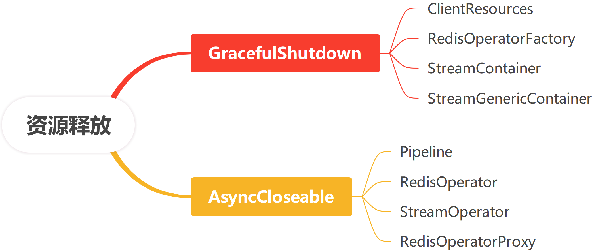

## Xredis  Reference Guide

**Author**: Patrick.Lau		**Version**: 1.0.1

[](https://www.apache.org/licenses/LICENSE-2.0.html) [](https://github.com/patricklaux/xredis/releases) [](https://central.sonatype.com/namespace/com.igeeksky.xredis) [](https://github.com/patricklaux/xredis/commits)


## 1. 基本说明

### 1.1. 文档版本

此文档最新版本位于 https://github.com/patricklaux/xredis/blob/main/docs/Reference.md，如您有任何改进，欢迎提交 pr。

### 1.2. 获取帮助

https://github.com/patricklaux/xredis/discussions

如您希望了解如何使用 xredis，或在使用中遇到问题无法解决，欢迎在此提问。

### 1.3. 建议反馈

https://github.com/patricklaux/xredis/issues

如您发现功能缺陷，或有任何开发建议，欢迎在此提交。

如您发现安全漏洞，请私信与我联系。

### 1.4. 项目测试

**测试用例**：https://github.com/patricklaux/xredis/tree/main/xredis-lettuce/src/test/

**示例项目**：https://github.com/patricklaux/xredis-samples

如您希望扩展实现，又或者对某处代码逻辑有疑问，您可以参考测试用例和示例项目，并对相关实现进行调试。

当然，也欢迎您补充更多的测试用例。


## 2. 相关介绍

### 2.1. 简介

Xredis 是对 `Lettuce` 的一个非常非常薄的封装。

1. 统一 `standalone`、`sentinel` 和 `cluster` 的 API，统一通过 `RedisOperator` 操作数据。
2. 提供 `RedisSyncOperator` 、`RedisAsyncOperator` 和 `RedisReactiveOperator` 接口，可以灵活使用不同编程范式。
3. 提供 `Pipeline` 接口，支持批提交命令。
4. 提供 `StreamContainer` 和 `StreamPublisher` ，简化 `Redis-Stream` 的订阅发布。
5. 提供 `RedisOperatorProxy`，简化批数据操作，提高批数据操作性能。
6. 提供 `SpringBoot` 自动配置，可以通过配置文件直接配置 `Lettuce` 的绝大部分配置项（有些特殊配置项需编程实现）。

总之，项目初衷是希望保留性能强大且功能灵活的 `Lettuce` 原生 API，在此基础上再去扩展一些实用的常用的功能。同时，能够支持 `SpringBoot ` 的自动配置，做到开箱即用。

### 2.3. 运行环境

| 名称           | 版本           | 关键理由                                                     |
| -------------- | -------------- | ------------------------------------------------------------ |
| **JDK**        | 21+            | 虚拟线程                                                     |
| **Lettuce**    | 6.5.4.RELEASE+ | 支持 `Redis-JSON` 操作，支持 `Redis-Hash` 设置字段的过期时间 |
| **SpringBoot** | 3.3.0+         | 虚拟线程                                                     |


## 3. 项目示例

以下代码片段来自于示例项目 [xredis-samples](https://github.com/patricklaux/xredis-samples)，如需获取更详细信息，您可以克隆示例项目到本地进行调试。

```bash
git clone https://github.com/patricklaux/xredis-samples.git
```

### 3.0. Maven bom

Xredis 支持 `bom` 方式，可在 `pom.xml` 文件中添加如下配置统一管理版本依赖。

```xml
<dependencyManagement>
    <dependencies>
        <dependency>
            <groupId>com.igeeksky.xredis</groupId>
            <artifactId>xredis</artifactId>
            <version>${xredis.version}</version>
            <type>pom</type>
            <scope>import</scope>
        </dependency>
    </dependencies>
</dependencyManagement>
```

### 3.1. 第一步：引入依赖

```xml
<dependencies>
    <!-- ... xredis 依赖 ... -->
    <dependency>
        <groupId>com.igeeksky.xredis</groupId>
        <artifactId>xredis-lettuce-spring-boot-autoconfigure</artifactId>
        <version>${xredis.version}</version>
    </dependency>

    <!-- ... 其它：假定使用 SpringWeb ... -->
    <dependency>
        <groupId>org.springframework.boot</groupId>
        <artifactId>spring-boot-starter-web</artifactId>
        <version>${spring.boot.version}</version>
    </dependency>
</dependencies>
```

### 3.2. 第二步：编写配置

```yaml
xredis:
  lettuce: # Lettuce 客户端配置
    standalone: # 单机模式 或 副本集模式
      node: 127.0.0.1:6379 # Redis 节点
```

这是 xredis 的最简配置，其余配置项均采用默认参数。

如果你希望更精细地控制客户端行为，想了解完整的配置项，请查看[8. 完全配置](#8. 完全配置)。

### 3.3. 第三步：调用方法

这里是将 Redis Server 作为用户信息存储，并使用 `async` 异步操作 Redis 数据。

```java
@Service
public class UserService {

    private final RedisOperator<String, String> redisOperator;
    private final JacksonCodec<User> codec = new JacksonCodec<>(User.class);

    /**
     * 使用 Spring 注入的 RedisOperator，创建 UserService
     *
     * @param redisOperator RedisOperator
     */
    public UserService(RedisOperator<String, String> redisOperator) {
        this.redisOperator = redisOperator;
    }

    /**
     * 添加用户信息
     *
     * @param user 用户信息
     * @return 添加结果
     */
    public CompletableFuture<Response<Void>> addUser(User user) {
        return redisOperator.async().set(user.getId() + "", codec.encode(user))
                .toCompletableFuture()
                .thenApply(result -> {
                    if (Objects.equals("OK", result)) {
                        return Response.ok();
                    }
                    return Response.error("Failed to add user.");
                });
    }

    /**
     * 获取用户信息
     *
     * @param id 用户 ID
     * @return 用户信息
     */
    public CompletableFuture<Response<User>> getUser(Long id) {
        return redisOperator.async().get(id + "")
                .toCompletableFuture()
                .thenApply(s -> {
                    if (s == null) {
                        return Response.error("User not found.");
                    }
                    return Response.ok(codec.decode(s));
                });
    }

    /**
     * 删除用户信息
     *
     * @param id 用户 ID
     * @return 删除结果
     */
    public CompletableFuture<Response<Void>> deleteUser(Long id) {
        return redisOperator.async().del(id + "")
                .toCompletableFuture()
                .thenApply(result -> {
                    if (Objects.equals(1L, result)) {
                        return Response.ok();
                    }
                    return Response.error("User doesn't exist.");
                });
    }

}
```

## 4. 基本使用

原生 `Lettuce` API，集群连接是 `StatefulRedisClusterConnection`，非集群连接是 `StatefulRedisConnection`，上层应用需明确知道使用的连接类型，或需通过一些特别转换才能屏蔽类型信息，很多场景会有些不便。

`RedisOperator` 则不再区分集群与非集群，提供了一套统一的接口，当应用在集群与非集群之间切换时仅需修改配置，无需修改代码。

```java
/**
 * Redis 操作入口
 */
public interface RedisOperator<K, V> extends ConnectionMode, AsyncCloseable {

    /**
     * 获取同步操作客户端
     *
     * @return RedisSyncOperator
     */
    RedisSyncOperator<K, V> sync();

    /**
     * 获取异步操作客户端
     *
     * @return RedisAsyncOperator
     */
    RedisAsyncOperator<K, V> async();

    /**
     * 获取响应式操作客户端
     *
     * @return RedisReactiveOperator
     */
    RedisReactiveOperator<K, V> reactive();

}
```

`RedisOperator` 有两个实现类：非集群模式为 `LettuceOperator`；集群模式为 `LettuceClusterOperator`。

`LettuceOperator` 支持执行事务命令，`LettuceClusterOperator` 支持高级集群命令，除此之外两者并无差异。

这其实也是 `Lettuce` 原生 API `StatefulRedisConnection` 和 `StatefulRedisClusterConnection` 的差异。

`RedisOperator` 做的其实就是移除这两点差异，从而得到两者 API 的最大子集。

### 4.1. 同步操作（sync）

```java
@SpringBootTest
public class RedisOperatorTest {

    @Autowired
    private RedisOperator<String, String> redisOperator;

    @Test
    void hget() {
        String key = "test-key", field = "test-field", value = "test-value";
        redisOperator.sync().del(key);

        Boolean status = redisOperator.sync().hset(key, field, value);
        Assertions.assertEquals(Boolean.TRUE, status);

        String result = redisOperator.sync().hget(key, field);
        Assertions.assertEquals(value, result);
    }

}
```

### 4.2. 异步操作（async）

```java
@SpringBootTest
public class RedisOperatorTest {

    @Autowired
    private RedisOperator<String, String> redisOperator;

    @Test
    void hgetAsync() throws ExecutionException, InterruptedException {
        String key = "test-key", field = "test-field", value = "test-value";
        redisOperator.sync().del(key);

        RedisFuture<Boolean> future = redisOperator.async().hset(key, field, value);
        Assertions.assertEquals(Boolean.TRUE, future.get());

        RedisFuture<String> result = redisOperator.async().hget(key, field);
        Assertions.assertEquals(value, result.get());
    }

}
```

### 4.3. 响应式操作（reactive）

```java
@SpringBootTest
public class RedisOperatorTest {

    @Autowired
    private RedisOperator<String, String> redisOperator;

    @Test
    void hgetReactive() {
        String key = "test-key", field = "test-field", value = "test-value";
        redisOperator.sync().del(key);

        Mono<Boolean> mono = redisOperator.reactive().hset(key, field, value);
        Assertions.assertEquals(Boolean.TRUE, mono.block());

        Mono<String> result = redisOperator.reactive().hget(key, field);
        Assertions.assertEquals(value, result.block());
    }

}
```

### 4.4. 小结

通过以上示例，其实可以发现 xredis 接口与 Lettuce 原生接口调用方式是完全一致的，事实上 ``RedisSyncOperator``、``RedisAsyncOperator``、``RedisReactiveOperator`` 和 ``Pipeline`` 接口都是继承自 Lettuce 原生接口。

Q：是否会有性能损失？

A：不会，只是将接口重新组织，既没有加一层，也没有对象类型转换。

Q：是否会有功能损失？

A：不会，实现类也是继承自 Lettuce 的原生类。

总之，原生 API 怎么用就怎么用，原生 API 什么性能就什么性能，原生 API 有什么 bug 就有什么 bug。


## 5. 扩展实现

### 5.0. 概述

`Xredis` 的主要扩展实现有 6 个：

1. `Pipeline`：管道，用于批量提交命令。
2. `RedisOperatorProxy`：代理类，主要用于简化批量数据操作。
3. `StreamOperator`：流操作，用于创建 `StreamPublisher` 、 `StreamContainer` 和 `StreamGenericContainer` 。
4. `StreamPublisher`：流消息发布。
5. `StreamContainer`：流消息拉取，使用公共参数的流容器，仅支持非消费者组。
6. `StreamGenericContainer`：流消息拉取，使用独立参数的流容器，消费者组和非消费者组都支持。

由于这些对象只有在特定场景才会用到，因此都没有预创建。

为方便后续编写代码示例，这里通过统一的自动配置类创建了全部对象。但对于用户而言，仅仅创建需要的对象即可。

```java
/**
 * Redis 扩展自动配置类
 * <p>
 * {@code RedisOperatorFactory} 已通过 {@code LettuceAutoConfiguration} 在应用启动时预创建，
 * 这里直接使用即可，无需再创建。
 *
 * @author Patrick.Lau
 * @since 1.0.0 2025/3/3
 */
@Configuration
public class RedisExtendAutoConfiguration {

    /**
     * 创建 Pipeline
     *
     * @param factory 预创建的 RedisOperatorFactory
     * @return Pipeline
     */
    @Bean
    Pipeline<String, String> pipeline(RedisOperatorFactory factory) {
        return factory.pipeline(StringCodec.UTF8);
    }

    /**
     * 创建 RedisOperatorProxy
     *
     * @param factory 预创建的 RedisOperatorFactory
     * @return RedisOperatorProxy
     */
    @Bean
    RedisOperatorProxy redisProxy(RedisOperatorFactory factory) {
        RedisOperator<byte[], byte[]> redisOperator = factory.redisOperator(ByteArrayCodec.INSTANCE);
        // 单批次命令提交数量阈值
        int batchSize = 10000;
        // 同步阻塞超时时长
        long timeout = 60000;
        return new LettuceOperatorProxy(batchSize, timeout, redisOperator);
    }

    /**
     * 创建 StreamOperator
     *
     * @param factory 预创建的 RedisOperatorFactory
     * @return StreamOperator
     */
    @Bean
    StreamOperator<String, String> streamOperator(RedisOperatorFactory factory) {
        return factory.streamOperator(StringCodec.UTF8);
    }

    /**
     * 创建 StreamPublisher
     * <p>
     * 用于发布用户信息
     *
     * @param streamOperator 预创建的 StreamOperator
     * @return StreamPublisher
     */
    @Bean
    StreamPublisher<String, String, User> streamPublisher(StreamOperator<String, String> streamOperator) {
        XAddOptions options = XAddOptions.builder().maxLen(10000).approximateTrimming().build();
        return new StreamPublisher<>("stream:user", options, streamOperator, new UserStreamCodec());
    }

    /**
     * 创建 ScheduledExecutorService
     * <p>
     * 用于 StreamContainer 和 StreamGenericContainer 的定时任务
     *
     * @return ScheduledExecutorService
     */
    @Bean(destroyMethod = "shutdown")
    ScheduledExecutorService scheduler() {
        return Executors.newScheduledThreadPool(2);
    }

    /**
     * 创建 StreamContainer
     *
     * @param factory   预创建的 RedisOperatorFactory
     * @param scheduler 预创建的 ScheduledExecutorService
     * @return StreamContainer
     */
    @Bean(destroyMethod = "shutdown")
    StreamContainer<String, String> streamContainer(RedisOperatorFactory factory,
                                                    ScheduledExecutorService scheduler) {
        // 任务执行间隔，单位毫秒
        int taskInterval = 10;
        // 流读取参数：读阻塞时长 10 毫秒，一次任务每个 Stream 的最大读取数量为 1000 条
        ReadOptions readOptions = ReadOptions.from(10L, 1000);
        return factory.streamContainer(StringCodec.UTF8, scheduler, taskInterval, readOptions);
    }

    /**
     * 创建 StreamGenericContainer
     *
     * @param factory   预创建的 RedisOperatorFactory
     * @param scheduler 预创建的 ScheduledExecutorService
     * @return StreamGenericContainer
     */
    @Bean(destroyMethod = "shutdown")
    StreamGenericContainer<String, String> streamGenericContainer(RedisOperatorFactory factory,
                                                                  ScheduledExecutorService scheduler) {
        // 任务执行间隔，单位毫秒
        int taskInterval = 10;
        return factory.streamGenericContainer(StringCodec.UTF8, scheduler, taskInterval);
    }

}
```


### 5.1. Pipeline

为了提高大批量操作数据的性能，某些情况下，我们会希望能够批量提交命令，而不是每个命令都提交一次。

此时，我们可以通过 `Pipeline` 来处理。

#### 5.1.1. 测试 Pipeline

```java
@SpringBootTest
public class PipelineTest {

    @Resource
    private Pipeline<String, String> pipeline;
    
    @Resource
    private RedisOperator<String, String> redisOperator;

    @Test
    public void test() throws ExecutionException, InterruptedException {
        // 1. 删除已有数据
        pipeline.del("key1", "key2", "key3");
        // 2. 设置数据
        pipeline.set("key1", "value1");
        pipeline.set("key2", "value2");
        pipeline.set("key3", "value3");
        // 3. 批量提交命令
        pipeline.flushCommands();

        // 4. 获取数据
        RedisFuture<String> result1 = pipeline.get("key1");
        RedisFuture<String> result2 = pipeline.get("key2");
        RedisFuture<String> result3 = pipeline.get("key3");
        // 5. 批量提交命令
        pipeline.flushCommands();

        Assertions.assertEquals("value1", result1.get());
        Assertions.assertEquals("value2", result2.get());
        Assertions.assertEquals("value3", result3.get());
    }

}
```

#### 5.1.2. 关于 Pipeline

##### 实现

非集群模式：`LettucePipeline`

集群模式：`LettuceClusterPipeline`

##### 异步

`Pipeline` 仅支持 `async` 方式调用，除了需手动调用 `pipeline.flushCommands()` 提交命令之外，其调用方式与 `RedisAsyncOperator` 完全一致。

`Pipeline` 其实就是预调用了 `StatefulConnection.setAutoFlushCommands(false)` 而已。

##### 性能

经简单测试，`Pipeline` 批量提交命令 和 `RedisAsyncOperator` 逐个提交命令，两者有一定的性能差异，但差距微小。

因为 `RedisAsyncOperator` 是异步操作，调用者无需等待上一命令的返回结果就可以继续发出下一个命令，其实与批量提交命令差别不大，批量提交命令仅仅是减少了 `flush` 次数从而有一些微弱的性能优势。

总之，大多数情况下，使用 `RedisAsyncOperator` 已经可以满足性能需求。

##### 线程安全

`Pipeline` 从设计目标上来说是线程安全的。

即是说，多个线程可以共用一个 `Pipeline` 对象。但每个线程批量提交命令结束后都需要手动调用  `pipeline.flushCommands()` ，才会将命令真正发送到 Redis Server 并获得返回结果。

譬如，线程1 提交命令后，还未调用 `flushCommands()`，而线程2 调用了  `flushCommands()`，那么线程1 的命令也会被提交，并且线程1和线程2 都会收到各自的命令的正确响应结果。

另外，如果线程1 的命令已经被线程2 提交，线程1 随后仍然调用了 `flushCommands()` ，即使底层连接的命令缓冲队列已无数据， `flush`了个寂寞，也不会有任何影响，且两个线程各自收到的命令响应结果依然是正确的。

##### 关于 bug 

`Lettuce` 的批量提交命令实现有些 bug，有时会遗漏命令，导致 ``RedisFuture`` 一直等待而无法得到结果，最后报命令超时异常。

官方说明是需等到 ``6.6.0`` 版本才会修复。

### 5.2. RedisOperatorProxy

#### 5.2.1. 批量增删数据

项目开发中，有时会需要大批量操作 `Redis` 数据，为了不影响业务正常运行，通常我们会将数据切分成多份，然后再循环提交。

通过 `RedisOperatorProxy`，可以无需手动编码切分数据，直接提交即可。

```java
@SpringBootTest
public class RedisOperatorProxyTest {

    @Resource
    RedisOperatorProxy redisProxy;

    /**
     * Redis-String：批量添加 100 万条数据，然后再批量删除
     */
    @Test
    public void mset_del() {
        int size = 1000000;
        byte[][] keys = new byte[size][];
        Map<byte[], byte[]> keysValues = HashMap.newHashMap(size);

        // 1. 创建 1000000 键值对作为测试数据
        for (int i = 0; i < size; i++) {
            byte[] key = ("test:del:key:" + i).getBytes();
            byte[] value = ("test:del:value:" + i).getBytes();
            keys[i] = key;
            keysValues.put(key, value);
        }

        // 2. 删除测试数据（sync）
        redisProxy.del(keys);

        // 3. 批量添加数据（sync）
        Assertions.assertEquals("OK", redisProxy.mset(keysValues));

        // 4. 批量删除数据（sync）
        Assertions.assertEquals(size, redisProxy.del(keys));
    }
}
```

这个测试示例，先批量添加了 100 万条数据，然后再批量删除了这 100 万条数据。

`RedisOperatorProxy` 的具体实现：

1. 首先，根据 `batchSize` 对数据进行切分；
2. 然后，分批提交命令到 Redis Server；
3. 最后，合并 Redis Server 的所有响应结果。如果是调用的同步方法，那么，等待结果的最大时长为 `timeout` 毫秒。

创建 `RedisOperatorProxy` 时传入的 `batchSize` 是 10000，`timeout` 为 60000。

所以，在上面这个测试实例中，会将 100 万数据切分成 100 份，每份 10000 条，并分批提交命令，最后等待并合并 Redis Server 的所有响应结果。如果等待超过 60000 毫秒后依然无法获取全部响应结果，那么就会报超时异常。

#### 5.2.2. Hash 字段过期

`Redis` 7.4.0 开始支持对 Hash 的字段设置过期时间，这对于缓存应用来说是非常有用的功能。

但是，设置值 和 设置字段过期时间居然要分成两个命令：`HSET` + `HPEXPIRE`，并没有类似于 `PSETEX ` 的合并命令。

命令分开有啥不好吗？

譬如，应用先提交了 `HSET` 命令，然后应用宕机或异常，并没有接着提交 `HPEXPIRE` 命令，那么就会有一个永不过期的字段存在。

如何解决这个问题哪？

要么使用事务，要么使用脚本，要么使用函数。

`RedisOperatorProxy` 的具体实现是使用脚本，同时在 Redis Server 端执行 `HSET` + `HPEXPIRE` 这两个命令，方法命名为 `hpset`。

此外，既然支持设置单个字段的值和过期时间，那么当然也支持批量设置字段的值和过期时间，方法命名为 `hmpset`，下面这个示例演示的是批量设置。

```java
@SpringBootTest
public class RedisOperatorProxyTest {

    @Resource
    RedisOperatorProxy redisProxy;

    /**
     * Redis-Hash：写入 100 万条数据，并为每个字段设置 3600 秒的过期时间
     */
    @Test
    void hmpset() {
        int size = 1000000;
        byte[] key = "test:hmpset:key".getBytes();

        // 1. 删除测试数据
        redisProxy.del(key);

        // 2. 创建 1000000 键值对作为测试数据
        List<KeyValue<byte[], byte[]>> fieldsValues = new ArrayList<>(size);
        for (int i = 0; i < size; i++) {
            byte[] field = ("field:" + i).getBytes();
            byte[] value = ("value:" + i).getBytes();
            fieldsValues.add(KeyValue.create(field, value));
        }

        // 3. 批量设置字段值，并设置字段的过期时间为 3600000 毫秒
        CompletableFuture<List<Long>> future = redisProxy.hmpsetAsync(key, 3600000, fieldsValues);

        // 4. 无限等待批量设置结果
        future.thenAccept(status -> {
            // 5. 验证是否设置成功
            for (int i = 0; i < size; i++) {
                Assertions.assertEquals(1L, status.get(i));
            }
        }).join();
    }
}
```

上面这个示例中，采用的是 `hmpsetAsync` 方法执行异步调用，所以 `timeout` 参数不会有任何作用。

#### 5.2.3. 脚本执行

对于脚本执行，`RedisOperatorProxy` 的实现也做了一些优化。

譬如调用 `EVALSHA` 命令时，如果 `Redis Server` 不存在该脚本，那么会报脚本不存在异常。

`RedisOperatorProxy` 检查到该异常后会先执行 `SCRIPTLOAD` 命令让 `Redis Server` 加载脚本，然后再执行 `EVAL` 命令操作数据。下次使用 `EVALSHA` 执行同一脚本时，就不会再报异常。

这样，可以让上层应用无需关心脚本是否已被 `Redis Server` 预加载。

#### 5.2.4. 其它

关于 `RedisOperatorProxy`，还有一些比较实用的小优化，这里不再一一列举，具体可以看实现类 `LettuceOperatorProxy`。

### 5.3. StreamOperator

`StreamOperator` 主要是作为以下三个类的组件，略。

### 5.4. StreamPublisher

`StreamPublisher`，用于将消息发布到指定的 Stream，见下一小节。

### 5.5. StreamContainer

`StreamContainer` 用于非消费者组的消息拉取并推送给订阅者，具体使用见如下示例：

```java
@SpringBootTest
public class StreamTest {

    private static final Logger log = LoggerFactory.getLogger(StreamTest.class);

    private final UserStreamCodec streamCodec = new UserStreamCodec();

    @Resource
    private StreamOperator<String, String> streamOperator;

    @Resource
    private StreamContainer<String, String> streamContainer;

    @Resource
    private StreamPublisher<String, String, User> streamPublisher;

    @Resource
    private ScheduledExecutorService scheduler;

    @Test
    public void testSubscribe() throws InterruptedException {
        // 1. 获取 Redis Server 的当前时间戳作为读取消息的起始位置
        long serverTime = streamOperator.timeMillis(StringTimeConvertor.getInstance());
        
        // 2. 创建 XStreamOffset 对象（stream 名称 和 起始位置）
        XStreamOffset<String> offset = XStreamOffset.from("stream:user", serverTime + "-0");
        
        // 3. 订阅流，streamContainer 返回 Flow 对象（无限数据流）
        Flow<XStreamMessage<String, String>> flow = streamContainer.subscribe(offset);
        
        // 4. 创建订阅者，用以消费消息和处理异常
        Disposable disposable = flow.subscribe(new Subscriber<>() {

            @Override
            public void onNext(XStreamMessage<String, String> message) {
                Map<String, String> body = message.body();
                User user = streamCodec.decodeMsg(body);
                if (user.getId() % 1000 == 0) {
                    log.info("收到消息：{}", user);
                }
                if (user.getId() % 10000 == 0) {
                    throw new RuntimeException("模拟消费异常");
                }
            }

            /**
             * 消息拉取异常处理
             *
             * @param t   拉取消息引发的异常
             * @param s   订阅关系维护
             */
            @Override
            public void onError(Throwable t, Subscription s) {
                // 消息拉取异常，暂停拉取 100ms
                s.pausePull(Duration.ofMillis(100));
                log.error("消息拉取异常，暂停拉取 100ms...{}", t.getMessage(), t);
            }

            /**
             * 消息消费异常处理
             *
             * @param t         消费消息引发的异常
             * @param message   消息
             * @param attempts  消费失败次数
             * @param s         订阅关系维护
             */
            @Override
            public void onError(Throwable t, XStreamMessage<String, String> message, int attempts,
                                RetrySubscription<XStreamMessage<String, String>> s) {
                if (attempts < 4) {
                    // 允许失败 4 次，每次失败后重试间隔延长 100ms
                    log.warn("消费失败，重试中...{}", t.getMessage(), t);
                    s.retry(message, Duration.ofMillis(attempts * 100L));
                } else {
                    log.error("消费失败，超过最大重试次数，放弃重试...{}", t.getMessage(), t);
                }
            }
            // 并行度为 2，即最多会有 2 个线程同时调用 Subscriber
        }, 2);

        // 5. 使用额外线程开始发布消息
        Future<?> publishFuture = scheduler.submit(() -> {
            for (long i = 0; i < 500000; i++) {
                if (i % 5000 == 0) {
                    try {
                        Thread.sleep(1000);
                    } catch (InterruptedException ignore) {
                    }
                }
                streamPublisher.publish(new User(i, "user-" + i, 18));
            }
        });

        // 6. 休眠 10 秒，观察期间的消息发布和消费信息打印
        Thread.sleep(10000);

        // 7. 取消订阅，但正在消费的当前数据仍将等待其完成
        disposable.dispose();

        // 8. 再次休眠 10 秒，取消订阅成功后消息拉取和消费都会停止，不会再有消息打印
        Thread.sleep(10000);

        // 9. 取消发布消息
        publishFuture.cancel(true);
    }

}
```

说明：

1. `Flow`：无限数据流，内部包含一个数据池，其大小为 `count` 参数的 2 倍。
2. `Subscriber`：订阅者，用于消费消息和处理异常。
3. `Subscription`：订阅关系管理维护，用于取消订阅、消息重试、暂停消费、暂停拉取等操作。
4. `Disposable`：用于取消订阅。

调用 `Flow.subscribe(subscriber)` 后，订阅正式开始。

`StreamContainer` 的其中一个任务会从 `Redis Server` 拉取消息，并发送给 Flow ，Flow 会先将消息暂存到数据池 `sink`。

`StreamContainer` 的另一个任务会将 Flow 数据池的消息推送给 `Subscriber` 消费，同时运行的消费任务数量取决于传入的并行度。

`StreamContainer`  检测到 `Flow` 数据池的容量不足时，说明 `Subscriber` 有大量未消费的消息，会自动暂停拉取消息。

同时，`StreamContainer` 也会根据 `Subscription` 的相关指令执行消费重试、暂停消费、暂停拉取等。

这其实就是典型的生产者消费者模型，只不过增加了 `Subscription` 来传递各种指令。如果对响应式编程有了解的话，一定会感到非常亲切。

### 5.6. StreamGenericContainer

`StreamGenericContainer` 与 `StreamContainer` 的操作类似，略。

## 6. 命令阻塞

`RedisOperator` 、 `Pipeline` 和 `StreamOperator`  都可以提交阻塞命令（如 `blpop` 、`xread` …… 等）。

但需特别注意的是，由于每个对象有且仅有一条与 Redis Server 的连接，因此如果提交了阻塞命令，在得到 Redis Server 返回的响应结果之前，后续提交的非阻塞命令都会被阻塞。

```java
@Test
public void testBlock() throws InterruptedException {
    // 1. 同步删除和添加数据
    redisOperator.sync().del("string-key", "list-key");
    redisOperator.sync().set("string-key", "string-value");

    // 2. Pipeline 阻塞读取 Redis-List 数据
    pipeline.blpop(100000, "list-key")
        .thenAccept(result -> System.out.printf("blpop:\t %d\n", System.currentTimeMillis()));

    // 3. Pipeline 非阻塞读取 Redis-String 数据
    pipeline.get("string-key")
        .thenAccept(result -> System.out.printf("get:\t %d\n", System.currentTimeMillis()));

    // 4. 批量提交命令
    pipeline.flushCommands();

    System.out.printf("start:\t %d\n", System.currentTimeMillis());

    // 5. 休眠 5 秒后再向 Redis-List 添加数据
    new Thread(() -> {
        try {
            Thread.sleep(5000);
            redisOperator.sync().rpush("list-key", "list-value1");
        } catch (InterruptedException ignore) {
        }
    }).start();

    System.out.printf("end:\t %d\n", System.currentTimeMillis());

    Thread.sleep(10000);
}
```

测试的最终结果如下：

```
start:	 1741010097853
end:	 1741010097855
blpop:	 1741010102883
get:	 1741010102883
```

可以看到，非阻塞命令 `get` 同样被阻塞了 5 秒，只因其在阻塞命令 `blpop` 之后执行。

因此建议：阻塞命令和非阻塞命令分开用不同的对象执行，阻塞命令使用独占对象，非阻塞命令则使用共享对象。


## 7. 资源释放

Xredis 关于资源释放有两类接口：

一是 `GracefulShutdown`，支持优雅停机，主要是一些池化类对象和工厂类对象实现此接口，可以通过配置调整静默时长和等待超时。

二是 `AsyncCloseable`，主要是连接类对象实现此接口，使用完毕或应用关闭时调用即可关闭连接。




如果是采用 `Spring` 管理对象的生命周期：

对于实现 `AsyncCloseable` 接口的对象无需声明 `destroyMethod` ，`Spring` 默认会调用 `close()` 方法释放资源。

对于实现 `GracefulShutdown` 接口的对象则需声明 `destroyMethod = "shutdown"`，`Spring` 才会调用 `shutdown()` 方法释放资源。

```java
@Bean
Pipeline<String, String> pipeline(RedisOperatorFactory factory) {
    return factory.pipeline(StringCodec.UTF8);
}

@Bean(destroyMethod = "shutdown")
StreamContainer<String, String> streamContainer(RedisOperatorFactory factory,
                                                ScheduledExecutorService scheduler) {
    ReadOptions readOptions = new ReadOptions(10L, 1000, false);
    return factory.streamContainer(StringCodec.UTF8, scheduler, 10, readOptions);
}
```

## 8. 完全配置

### 8.1. 完全配置

即示例项目的 ``application-all.yml``。

```yaml
xredis:
  lettuce: # Lettuce 客户端配置
    id: lettuce # RedisOperatorFactory 唯一标识
    standalone: # 单机模式 或 副本集模式
      # 这里为了演示 standalone，sentinel，cluster 分别如何配置，所以三种配置都存在，实际只需保留真正使用的其中一种
      # 当三种配置都存在时，那么优先使用 sentinel 配置，其次 cluster，最后 standalone
      node: 127.0.0.1:6379 # Redis 节点（支持 UnixSocket 方式）
      nodes: 127.0.0.1:6378 # Redis 节点列表（如 nodes 无配置，主动发现并连接新节点；如 nodes 有配置，仅连接已配置的节点）
      read-from: # 读节点选择策略（默认值：UPSTREAM，仅从主节点读取数据）
      username: # Redis 用户名
      password: # Redis 密码
      database: 0 # Redis 数据库索引（默认值：0）
      client-name: # Redis 客户端名称
      ssl: false # 是否启用 SSL（默认值：false）
      start-tls: false # 是否启用 TLS（默认值：false）
      ssl-verify-mode: FULL # SSL 验证模式，只有 ssl 配置为 true 时才有意义（默认值：FULL）
      timeout: 60000 # 命令响应的最大等待时长（默认值：60000 单位：毫秒）
      shutdown-timeout: 2000 # 优雅停机最大等待时长（默认值：1000 单位：毫秒）
      shutdown-quiet-period: 100 # 优雅停机静默时长（默认值：100 单位：毫秒）
      client-options: # 客户端选项，一般保持默认即可
        auto-reconnect: true # 是否自动重连（默认值：true）
        disconnected-behavior: DEFAULT # 连接断开后是否接受命令（默认值：DEFAULT）
        publish-on-scheduler: false # 是否使用专用的 scheduler 处理 publish 事件（默认值：false）
        ping-before-activate-connection: true # 连接激活前是否发送 PING 消息（默认值：true）
        protocol-version: RESP2 # Redis 协议版本（默认值：RESP3，Redis 6.0 以下请配置为 RESP2）
        suspend-reconnect-on-protocol-failure: # 是否在协议失败时暂停重连（默认值：false）
        request-queue-size: # 请求队列大小 （默认值：Integer.MAX_VALUE）
        socket-options: # socket 配置选项
          connect-timeout: 10000 # Socket 连接超时（默认值：10000， 单位：毫秒）
          tcp-no-delay: true  # 是否启用 TCP_NODELAY（默认值：true）
          keep-alive: # KeepAlive 配置选项，仅适用于 epoll、 io_uring、Java 11 及之后版本的 NIO
            enabled: false # 是否启用 KeepAlive（默认值：false）
            count: 9 # KeepAlive 重试次数（默认值：9）
            idle: 7200000 # KeepAlive 空闲时间（默认值：7200000， 单位：毫秒）
            interval: 75000 # KeepAlive 发送间隔（默认值：75000， 单位：毫秒）
          tcp-user-timeout: # TCP_USER_TIMEOUT 配置选项，仅适用于 epoll 和 io_uring
            enabled: false # 是否启用 TCP_USER_TIMEOUT（默认值：false）
            tcp-user-timeout: 7875000 # TCP 超时配置（默认值：7875000 单位：毫秒）
        ssl-options: # SSL 配置选项，只有 ssl 配置为 true 时才有意义
          ssl-provider: JDK # （默认值：JDK）
          key-store-type: # 密钥库格式（默认值：jks）
          keystore: # 密钥库路径
          keystore-password: # 密钥库密码
          truststore: # 信任库路径
          truststore-password: # 信任库密码
          protocols: # 支持的安全协议
          cipher-suites: # 支持的加密套件
          handshake-timeout: # 握手超时（默认值：10000 单位：毫秒）
        timeout-options: # 命令超时配置选项
          fixedTimeout: # 固定超时时间（默认值：-1，单位：毫秒，无超时配置）
    sentinel: # 哨兵模式配置
      # 这里为了演示 standalone，sentinel，cluster 分别如何配置，所以三种配置都存在，实际只需保留真正使用的其中一种
      # 当三种配置都存在时，那么优先使用 sentinel 配置，其次 cluster，最后 standalone
      master-id: mymaster # 哨兵主节点名称
      nodes: 127.0.0.1:26377, 127.0.0.1:26378, 127.0.0.1:26379 # 哨兵节点列表
      read-from: # 读节点选择策略（默认值：UPSTREAM，仅从主节点读取数据）
      sentinel-username:  # 哨兵用户名
      sentinel-password:  # 哨兵密码
      username:  # Redis 用户名
      password:  # Redis 密码
      database: 0 # Redis 数据库索引（默认值：0）
      client-name: # Redis 客户端名称
      ssl: false # 是否启用 SSL（默认值：false）
      start-tls: false # 是否启用 TLS（默认值：false）
      ssl-verify-mode: FULL # SSL 验证模式，只有 ssl 配置为 true 时才有意义（默认值：FULL）
      timeout:  # 命令响应的最大等待时长（默认值：60000 单位：毫秒）
      shutdown-timeout: 2000 # 优雅停机最大等待时长（默认值：1000 单位：毫秒）
      shutdown-quiet-period: 100 # 优雅停机静默时长（默认值：100 单位：毫秒）
      client-options: # 客户端选项，一般保持默认即可
        auto-reconnect: true # 是否自动重连（默认值：true）
        disconnected-behavior: DEFAULT # 连接断开后是否接受命令（默认值：DEFAULT）
        publish-on-scheduler: false # 是否使用专用的 scheduler 处理 publish 事件（默认值：false）
        ping-before-activate-connection: true # 连接激活前是否发送 PING 消息（默认值：true）
        protocol-version: RESP2 # Redis 协议版本（默认值：RESP3，Redis 6.0 以下请配置为 RESP2）
        suspend-reconnect-on-protocol-failure: # 是否在协议失败时暂停重连（默认值：false）
        request-queue-size: # 请求队列大小 （默认值：Integer.MAX_VALUE）
        socket-options: # socket 配置选项
          connect-timeout: 10000 # Socket 连接超时（默认值：10000， 单位：毫秒）
          tcp-no-delay: true  # 是否启用 TCP_NODELAY（默认值：true）
          keep-alive: # KeepAlive 配置选项，仅适用于 epoll、 io_uring、Java 11 及之后版本的 NIO
            enabled: false # 是否启用 KeepAlive（默认值：false）
            count: 9 # KeepAlive 重试次数（默认值：9）
            idle: 7200000 # KeepAlive 空闲时间（默认值：7200000， 单位：毫秒）
            interval: 75000 # KeepAlive 发送间隔（默认值：75000， 单位：毫秒）
          tcp-user-timeout: # TCP_USER_TIMEOUT 配置选项，仅适用于 epoll 和 io_uring
            enabled: false # 是否启用 TCP_USER_TIMEOUT（默认值：false）
            tcp-user-timeout: 7875000 # TCP 超时配置（默认值：7875000 单位：毫秒）
        ssl-options: # SSL 配置选项，只有 ssl 配置为 true 时才有意义
          ssl-provider: JDK # （默认值：JDK）
          key-store-type: # 密钥库格式（默认值：jks）
          keystore: # 密钥库路径
          keystore-password: # 密钥库密码
          truststore: # 信任库路径
          truststore-password: # 信任库密码
          protocols: # 支持的安全协议
          cipher-suites: # 支持的加密套件
          handshake-timeout: # 握手超时（默认值：10000 单位：毫秒）
        timeout-options: # 命令超时配置选项
          fixedTimeout: # 固定超时时间（默认值：-1，单位：毫秒，无超时配置）
    cluster: # 集群模式配置
      # 这里为了演示 standalone，sentinel，cluster 分别如何配置，所以三种配置都存在，实际只需保留真正使用的其中一种
      # 当三种配置都存在时，那么优先使用 sentinel 配置，其次 cluster，最后 standalone
      nodes: 127.0.0.1:7001, 127.0.0.1:7002, 127.0.0.1:7003, 127.0.0.1:7004, 127.0.0.1:7005, 127.0.0.1:7006 # 集群节点列表
      read-from: # 读节点选择策略（默认值：UPSTREAM，仅从主节点读取数据）
      username: redis-admin # Redis 用户名
      password: 123456 # Redis 密码
      database: 0 # Redis 数据库索引（默认值：0）
      client-name: # Redis 客户端名称
      ssl: false # 是否启用 SSL（默认值：false）
      start-tls: false # 是否启用 TLS（默认值：false）
      ssl-verify-mode: FULL # SSL 验证模式，只有 ssl 配置为 true 时才有意义（默认值：FULL）
      timeout:  # 命令响应的最大等待时长（默认值：60000 单位：毫秒）
      shutdown-timeout: 2000 # 客户端关闭超时（默认值：1000 单位：毫秒）
      shutdown-quiet-period: 100 # 优雅停机静默时长（默认值：100 单位：毫秒）
      client-options: # 集群客户端选项，一般保持默认即可
        auto-reconnect: true # 是否自动重连（默认值：true）
        disconnected-behavior: DEFAULT # 连接断开后是否接受命令（默认值：DEFAULT）
        ping-before-activate-connection: true # 连接激活前是否发送 PING 消息（默认值：true）
        protocol-version: RESP2 # Redis 协议版本（默认值：RESP3，Redis 6.0 以下请配置为 RESP2）
        publish-on-scheduler: false # 是否使用专用的 scheduler 处理 publish 事件（默认值：false）
        request-queue-size: # 请求队列大小 （默认值：Integer.MAX_VALUE）
        suspend-reconnect-on-protocol-failure: # 是否在协议失败时暂停重连（默认值：false）
        max-redirects: # 集群重定向最大重试次数（默认值：5）
        validate-cluster-node-membership: # 是否验证集群节点成员关系（默认值：true）
        node-filter:    # 建立连接的节点[白名单] （如未配置，连接所有节点；如有配置，只连接配置节点）
        topology-refresh-options: # 节点拓扑刷新配置选项
          adaptive-refresh-triggers: # 动态刷新触发器，列表类型（默认为空集）
          adaptive-refresh-timeout: # 动态刷新超时（默认值：30000 单位：毫秒）
          close-stale-connections: # 是否关闭旧连接（默认值：true）
          dynamic-refresh-sources: # 是否动态刷新节点源（默认值：true）
          periodic-refresh-enabled: # 是否启用周期刷新（默认值：true）
          refresh-period: # 刷新周期 （默认值：30000 单位：毫秒）
          refresh-triggers-reconnect-attempts: # 刷新触发器重连尝试次数（默认值：3）
        socket-options: # socket 配置选项
          connect-timeout: 10000 # Socket 连接超时（默认值：10000， 单位：毫秒）
          tcp-no-delay: true  # 是否启用 TCP_NODELAY（默认值：true）
          keep-alive: # KeepAlive 配置选项，仅适用于 epoll、 io_uring、Java 11 及之后版本的 NIO
            enabled: false # 是否启用 KeepAlive（默认值：false）
            count: 9 # KeepAlive 重试次数（默认值：9）
            idle: 7200000 # KeepAlive 空闲时间（默认值：7200000， 单位：毫秒）
            interval: 75000 # KeepAlive 发送间隔（默认值：75000， 单位：毫秒）
          tcp-user-timeout: # TCP_USER_TIMEOUT 配置选项，仅适用于 epoll 和 io_uring
            enabled: false # 是否启用 TCP_USER_TIMEOUT（默认值：false）
            tcp-user-timeout: 7875000 # TCP 超时配置（默认值：7875000 单位：毫秒）
        ssl-options: # SSL 配置选项，只有 ssl 配置为 true 时才有意义
          ssl-provider: JDK # （默认值：JDK）
          key-store-type: # 密钥库格式（默认值：jks）
          keystore: # 密钥库路径
          keystore-password: # 密钥库密码
          truststore: # 信任库路径
          truststore-password: # 信任库密码
          protocols: # 支持的安全协议
          cipher-suites: # 支持的加密套件
          handshake-timeout: # 握手超时（默认值：10000 单位：毫秒）
        timeout-options: # 命令超时配置选项
          fixedTimeout: # 固定超时时间（默认值：-1，单位：毫秒，无超时配置）
```

### 8.2. 信息提示

`Xredis` 在编译过程中创建了 `spring-configuration-metadata`，所有配置项都可通过 IDE 实现自动补全、信息提示……等。


## 9. 项目模块

`Xredis` 当前共有 5 个模块，以下是各模块的简单介绍。

| 模块名称                                 | 类型 | 模块说明                                                   |
| :--------------------------------------- | :--: | :--------------------------------------------------------- |
| xredis                                   | pom  | 所有子项目的最顶层父项目，用于统一项目构建和版本依赖。     |
| xredis-common                            | jar  | 基础模块，用于定义基础接口，及与客户端实现无关的功能扩展。 |
| xredis-lettuce                           | jar  | 核心模块，主要用于实现具体的客户端逻辑。                   |
| xredis-lettuce-resources-autoconfigure   | jar  | 依赖于 SpringBoot，自动配置并创建客户端需用到的相关资源。  |
| xredis-lettuce-spring-boot-autoconfigure | jar  | 依赖于 SpringBoot，自动配置并创建 Redis 客户端。           |

